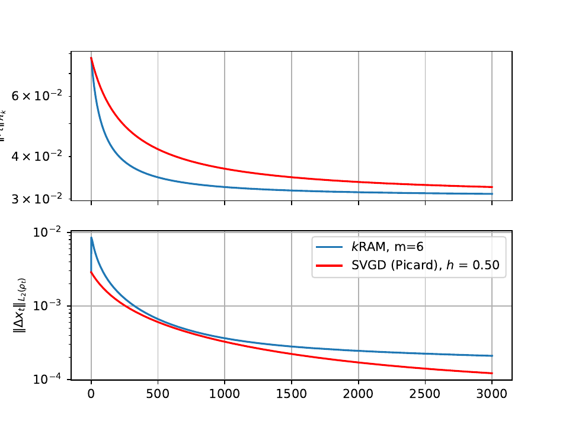
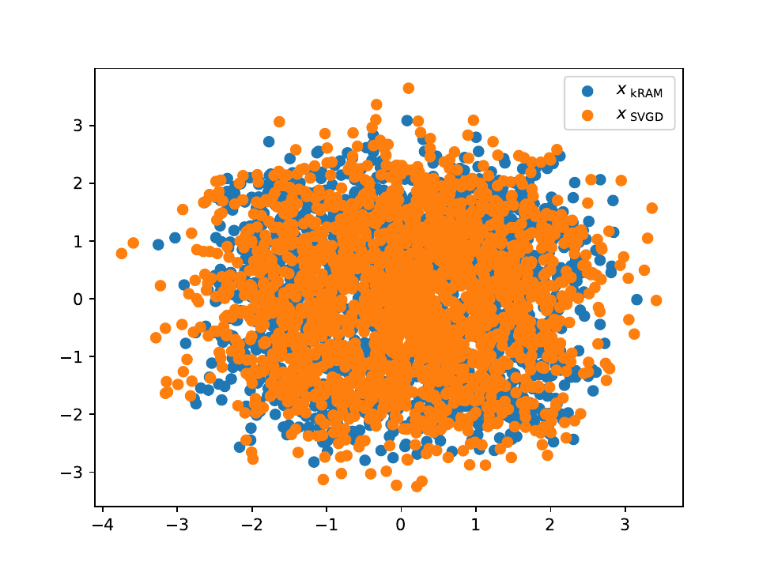

# Fixed-point problems in Stein space
The goal is to design novel algorithms for samplig and optimization over probability measures by adapting accelerated Riemannian fixed-point methods.
The methods take a sample from a tractable initial distribution and gradually transforms it towards the target, using the history of the previous gradients and updates to accelerate convergence.
The key ingredient is constraining the vector fields to some reproducing kernel Hilbert space (RKHS), as in the well-known Stein Variational Gradient Descent (SVGD) method.
## Mathematical description

For a given ISPD kernel $k$, we consider a space of smooth probability densities

$$
\mathcal{P}_k(\mathbb{R^d}) := 
  \left\\{
        \rho \in \mathcal{P}(\mathbb{R}^d):
        \begin{gathered}
            \rho \text{ has smooth Lebesgue density},\\
            \mathrm{supp} \rho = \mathbb{R}^d,\\
            \int k(x, x)\mathrm{d}\rho(x) < \infty
        \end{gathered} 
      \right\\}
$$

with the associated (extended) metric

$$
\begin{align}
    \mathrm{d}^2(\rho_0, \rho_1) := &\min\limits_{%
    \begin{aligned}\rho_t &\in \mathcal{P}_k \\\\ v_t &\in \mathcal{H}^d_k \end{aligned}}
    \int\limits_0^1\|v_t\|^2_{\mathcal{H}^d_k}\mathrm{d}{t}, \\
        &\mathrm{s.t.}\quad
        \begin{aligned}\notag
          \partial_t \rho_t + \nabla(\rho_t v_t) &= 0,\\
            \rho_t(0) &= \rho_0\\  
            \rho_t(1) &= \rho_1
        \end{aligned}
\end{align}
$$

where $\mathcal{H}^d_k$ is the vector-valued reproducing kernel Hilbert space (RKHS), associated to the kernel $k$.

We wish to solve fixed-point problems, i.e. for some operator $G$ such that

$$
  G:  \mathcal{P}_k(\mathbb{R}^d) \to  \mathcal{P}_k(\mathbb{R}^d) 
$$

look for a density $\rho_*$

$$
  \\rho_* : \\ G(\rho_* ) = \\rho_* 
$$


This infinite-dimensional metric space has a structure, similar to a Riemannian manifold.
The goal of this project is to identify interesting fixed-point problems and to provide accelerated iterative solution with Riemannian Anderson Mixing.

## Installation

```bash
pip install --upgrade fps@git+https://github.com/viviaxenov/fps
```

### Requirements

* [`jax`](https://docs.jax.dev/en/latest/) &ndash; handles automatic differentiation and compilation for running on GPU 

Optional:

* [`flax`](https://flax.readthedocs.io/en/latest/nnx_basics.html) &ndash; neural network framework to reproduce the Bayesian Regression example
* [`emcee`](https://emcee.readthedocs.io/en/stable/) &ndash; an implementation of MCMC to provide reference samples


## Usage example

Here we demonstrate sampling from a model distribution, described by its unnormalized log density.
In particular, the distribution has the form:

$$
    \\rho(x) \\propto e^{-\\| x \\|_p}, p = 4
$$


```python
import jax
from fpw.kernelRAMSolver import *

# Define the main parameters of the problem
N_samples = 2000
dim = 20
N_iter = 3000

# define the target distribution
m_targ = 0.0
p = 4.0
log_density_targ = lambda _x: -(((jnp.abs(_x - m_targ) ** p).sum()) ** (1.0 / p))

# Produce initial sample
key = jax.random.key(seed=5)
x0 = jax.random.normal(key, (N_samples, dim))

# Define a Gaussian RBF kernel with bandwith estimated from the median heuristic  
bandwidth = bandwidth_median(x0)
kern = lambda _x1, _x2: jnp.exp(-((_x1 - _x2) ** 2).sum() / bandwidth**2)

# Define the operator as the Stein Gradient of KL divergence to the target distribution
stepsize_SVGD = 0.5
oper = getOperatorSteinGradKL(log_density_targ, -stepsize_SVGD)

solver = kernelRAMSolver(
    oper,
    kern,
    relaxation=3.00,
    l2_regularization=8e-3,
    history_len=6,
)

x_SVGD, (d_rkhs, d_l2) = jax.lax.scan(stepSVGD, x0.copy(), length=N_iter)

solver, (d_rkhs_kram, d_l2_kram) = solver.iterate(x0.copy(), max_iter=N_iter)
x_kRAM = solver._x_cur

```
<details>
<summary>Code for plotting the results</summary>

```
label_RAM = f"$k$RAM, m={solver._m}"

fig, axs = plt.subplots(2, 1, sharex=True)

ax = axs[0]
ax.plot(d_rkhs_kram)
ax.plot(d_rkhs, color="r")
ax.set_ylabel(r"$\|r_t\|_{\mathcal{H}^d_k}$")

ax = axs[1]
ax.plot(d_l2_kram, label=label_RAM)
ax.plot(d_l2, label=f"SVGD (Picard), $h$ = {stepsize_SVGD:.2f}", color="r")
ax.set_ylabel(r"$\|\Delta x_t \|_{L_2(\rho_t)}$")

for ax in axs:
    ax.set_yscale("log")
    ax.grid()

axs[-1].legend()

fig.savefig("test_kRAM_convergence.pdf")

fig, axs = plt.subplots(1, 1)
axs.scatter(*x_kRAM[:, :2].T, label=r"$x_\text{ kRAM}$")
axs.scatter(*x_SVGD[:, :2].T, label=r"$x_\text{ SVGD }$")
# axs.scatter(*sample_targ[:, :2].T, label=r"$x_{\infty}$")
axs.legend()

fig.savefig("test_kRAM_scatter.pdf")
```

</details>

### Output
  
 

